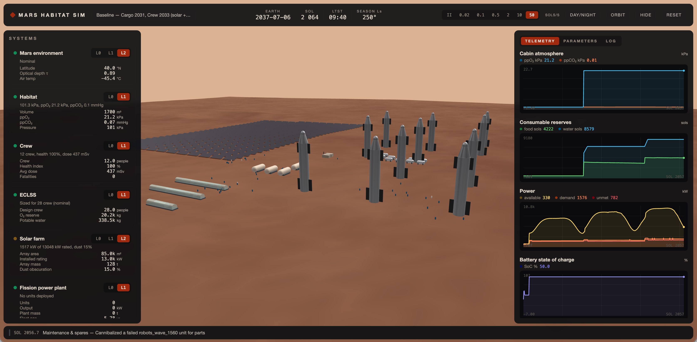

# Mars Habitat Sim

A composable, multi-fidelity simulation of a Mars surface settlement built on **SpaceX
Starship v3** logistics — a trade-study tool for the questions that decide mission
architecture, wrapped in a 3D hyper-timelapse of the base growing over the years.

### ▶ [Launch the live simulation](https://adamraudonis.github.io/mars_sim/)

[](https://adamraudonis.github.io/mars_sim/)

> **The primary implementation is the web app in [`web/`](web/)** (TypeScript sim core +
> Three.js + React; fully static, shareable on any host — `cd web && bun install && bun
> run dev`). The Unity project below is kept as the validated **reference implementation**
> (see [MarsHabitatSim/REFERENCE_ONLY.md](MarsHabitatSim/REFERENCE_ONLY.md)); its C# core
> was the specification for the port and both share the same parameter database,
> scenarios, and physics anchors.

Built for analysis, not gameplay: **every default parameter carries a citation**
(NASA BVAD, NTRS, MSL/MER/InSight/MOXIE flight data, peer-reviewed ISRU studies, and
clearly-flagged SpaceX company claims), everything is tunable live, and each subsystem runs
at selectable fidelity — from sub-sol physics (L2) to distilled scalar coefficients (L0).
See the [architecture doc](docs/ARCHITECTURE.md) for the design.

## Repository layout

```
Mars Sim/
├── MarsHabitatSim/            Unity 6 project (open this in Unity Hub)
│   ├── Assets/MarsSim/Core/       engine-agnostic simulation core (pure C#, no UnityEngine)
│   ├── Assets/MarsSim/Unity/      3D base view, timelapse, UI (charts, parameter inspector)
│   ├── Assets/MarsSim/Editor/     project setup, trade-study menu, headless runners
│   ├── Assets/MarsSim/Tests/      EditMode test suite (physics anchors, conservation, smoke)
│   └── Assets/StreamingAssets/    parameters_master.json + scenarios/*.json
├── research/                  the sourced parameter research campaign
│   ├── domains/*.md|.json         per-domain deep dives with equations & citations
│   ├── parameters_master.json     merged, verification-passed parameter database
│   └── RESEARCH_REPORT.md         executive summary + trade-study implications
├── docs/ARCHITECTURE.md       design: kernel, resource network, fidelity ladder
└── studies/out/               CSV outputs from trade studies
```

## Getting started

1. Open `MarsHabitatSim/` in Unity 6 (6000.4+).
2. Run **MarsSim → Setup Project** once (creates URP assets, UI theme, and the
   `Assets/Scenes/MarsBase.unity` bootstrap scene). This also runs automatically before
   headless verification.
3. Open `Assets/Scenes/MarsBase.unity` and press **Play**.

You get the baseline campaign: five cargo Starships land in Sep 2031, robots build out the
solar farm and ISRU plant, twelve crew arrive Nov 2033, and the return ship must be fueled
by the mid-2035 window. Use the top-bar speed buttons for hyper-timelapse (up to 50 sols/s),
watch ppO₂ / water / power / propellant evolve in the Charts tab, edit any sourced
parameter live in the Parameters tab, and switch any module between L0/L1/L2 in the
Systems panel.

### The fidelity ladder (the core idea)

Every subsystem implements up to three model depths, switchable per-module at runtime:

| | meaning | example: solar |
|---|---|---|
| **L2** | sub-sol physics | sun geometry × Beer-law extinction vs τ × dust deposition/cleaning × temperature derate, stochastic storm process |
| **L1** | analytic seasonal | same insolation, dust at cleaning equilibrium |
| **L0** | distilled scalar | one number: kWh/sol per installed kW |

**Distill** buttons (Charts tab) run a subsystem at L2 in isolation, fit the L0
coefficients, install them as overrides, and report what variability was thrown away. Go
deep on what matters, average what doesn't — and drill back down when a distilled number
turns out to drive the answer.

## Scenarios & trade studies

Scenarios are JSON (`Assets/StreamingAssets/scenarios/`): site, epoch, flights + manifests,
fidelity map, parameter overrides, return windows. Three ship with the project:

- `baseline.json` — solar + ice-mining architecture
- `nuclear.json` — 25× 40 kWe fission units instead of the big solar farm
- `h2_import.json` — Mars-Direct style: no ice mine; Earth H₂ + MOXIE-style SOXE oxygen

Canned studies (menu **MarsSim → Studies**, or headless):

```bash
Unity -batchmode -nographics -quit -projectPath MarsHabitatSim \
      -executeMethod MarsSim.EditorTools.TradeStudyMenu.RunHeadless -study solar_vs_nuclear
```

Studies: `solar_vs_nuclear`, `solar_sizing`, `spares_vs_kfactor`, `food_closure`,
`robot_count`. Each row of the output CSV is one full mission run (sweep point × Monte
Carlo seed) with objective metrics: propellant-by-window, unmet power, crew health, spares
shortfalls, minimum food margin, radiation dose.

## Tests

```bash
Unity -batchmode -nographics -projectPath MarsHabitatSim -runTests -testPlatform EditMode
```

The suite anchors the models to published values (Allison & McEwen Ls, Appelbaum & Flood
insolation bands, ISRU stoichiometry: 0.49 kg water/kg propellant, ~0.25 kg H₂/kg CH₄ in
import mode), checks exact mass-ledger conservation, deterministic replay, failure/sparing
behavior, and runs the shipped scenarios end-to-end into the crewed era.

## Status

All 24 EditMode tests pass. The shipped baseline (validated headless over 2,200 sols,
seed 42): zero fatalities, ppO₂ held at 21.2 kPa throughout, the first return ship is
fueled by crew arrival and both crew ships depart fully fueled (1,200 t each) at the first
Earth-return window — through two τ≈11 global dust storms. `screenshots/` holds live
timelapse captures; `studies/out/debug_baseline.txt` holds the full mission vitals + log.
Automated visual verification: **MarsSim → (menu) PlayModeVerifier.Run** or the headless
commands in `docs/TRADE_STUDIES.md`.

## Provenance

`research/` was produced by a multi-agent research campaign over NASA/JPL/academic sources
with an adversarial verification pass; `parameters_master.json` is what the sim loads at
startup. Every parameter in the in-app inspector shows its value **and its citation**.
SpaceX figures (payload, tank capacity, schedules) are company claims and marked as such —
treat scenario timelines as *inputs to study*, not predictions.
